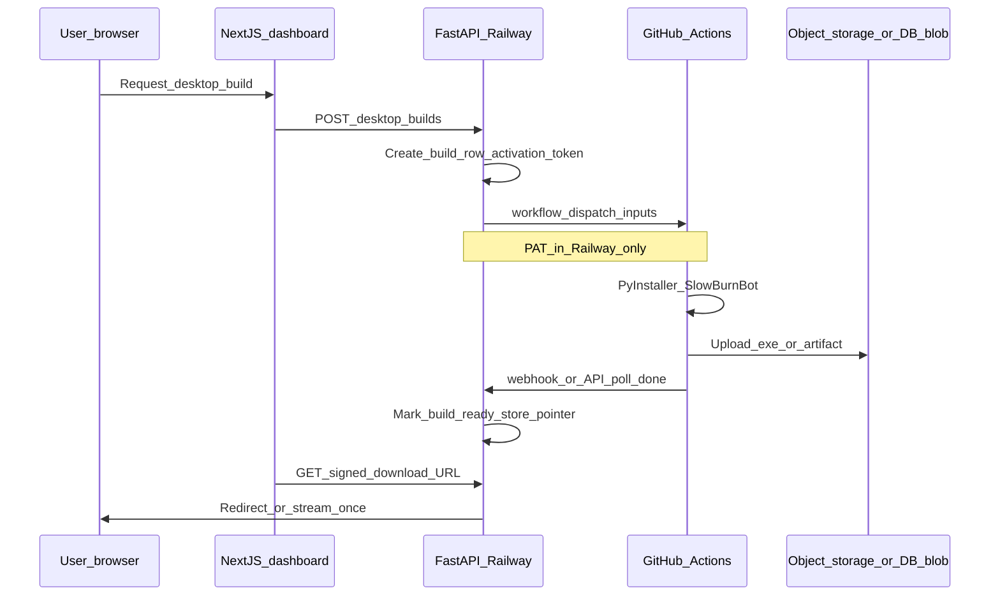

# Per-customer Windows EXE via GitHub Actions (SlowBurnBotGamma)

## How this maps to your stack today

| Generic idea | This repo |
|--------------|-----------|
| Customer | [`User`](app/models/) (UUID) from invite + JWT auth ([`app/auth.py`](app/auth.py), [`frontend/app/register/page.tsx`](frontend/app/register/page.tsx)) |
| clientID | Already in bot INI as `client_id` (int) under `[bot_settings]` in [`bot-client/burnBot_config.ini.example`](bot-client/burnBot_config.ini.example); used with [`ClientHeartbeat`](app/models/client_heartbeat.py) / [`/accounts/client-status`](app/routers/accounts.py) |
| License / phone-home | Extend backend with **short-lived activation tokens** (opaque, stored hashed, revocable) validated before or alongside existing JWT login in [`bot-client/burnBot_apiClient.py`](bot-client/burnBot_apiClient.py)—do **not** put `secret_key`, Stripe keys, or GitHub PAT in the EXE |
| Build | [`bot-client/SlowBurnBot.spec`](bot-client/SlowBurnBot.spec) already targets `burnBot.py` → `SlowBurnBot.exe`; workflow should mirror local `pip install -r bot-client/requirements.txt` + `pyinstaller bot-client/SlowBurnBot.spec` on **windows-latest** |
| Config injection | Bot today **requires** an on-disk INI path ([`burnBot_config.load_config`](bot-client/burnBot_config.py)); CI should generate a **non-secret** `burnBot_config.ini` (e.g. `api_url`, `client_id`, empty credentials) and add it via PyInstaller `--add-data` or extend the spec `datas=`—optional follow-up is a tiny bootstrap path (env vars) if you want true onefile without adjacent ini |

## Architecture (recommended)

**Important GitHub limitation:** the public **Artifacts** API is awkward for end-user downloads and has retention limits. Pragmatic split:

- **Trigger + build:** GitHub Actions (as you want).
- **Durable private download:** after the run succeeds, either (a) upload the `.exe` to **S3-compatible storage** (Railway bucket, R2, etc.) with a server-generated presigned URL, or (b) keep artifact on GitHub but have **only the backend** fetch it with the PAT and re-host once (still short-lived URL to the user). Avoid exposing the PAT or raw artifact IDs to browsers.

## Backend (FastAPI) work

1. **Settings** — extend [`app/settings.py`](app/settings.py) with: `github_token`, `github_repo` (`owner/name`), `github_workflow_file` (e.g. `build-desktop.yml`), optional `github_webhook_secret`, and object-storage credentials if you upload off-GitHub.

2. **Data model** — new table e.g. `desktop_builds`:
   - `id` (uuid), `user_id` (fk), `client_id` (int, unique per user with your chosen rule), `status` (`queued|running|ready|failed|revoked`), `github_run_id`, `artifact_sha256`, `storage_key` or `download_url` (internal), `created_at`, `expires_at`, `download_count`, `failure_reason`.
   - Separate table or columns for **activation**: `activation_token_hash`, `activation_token_expires`, `activated_at` (nullable).

3. **API routes** (authenticated, entitlement-gated using existing subscription checks like other bot routes):
   - `POST /desktop-builds` — allocates `client_id` (e.g. next free integer for that user consistent with heartbeat uniqueness), mints one-time activation secret (show once or never show; can be embedded only in CI inputs), calls [GitHub “create a workflow dispatch event”](https://docs.github.com/en/rest/actions/workflows?apiVersion=2022#create-a-workflow-dispatch-event) with inputs: `user_id`, `client_id`, `api_base_url`, `activation_token`, `build_id`.
   - `GET /desktop-builds/{id}` — poll status for the dashboard.
   - `GET /desktop-builds/{id}/download` — if `ready`, return **302 to presigned URL** or streaming response; enforce expiry + max downloads + user ownership.
   - `POST /bot/desktop/activate` (or under existing [`app/routers/bot.py`](app/routers/bot.py)) — EXE startup calls with `user_id` + `activation_token` + `client_id` → server validates, marks activated, optionally returns “continue with normal JWT login” instructions. Keeps revocation/expiry on your side.

4. **GitHub callback (optional but cleaner than blind polling)** — `POST /integrations/github/workflow` with HMAC signature verifying `github_webhook_secret`, updating `desktop_builds` from `workflow_job` / `workflow_run` payloads. If you skip webhooks, a **background worker** or on-demand poll from `GET /desktop-builds/{id}` can query [workflow run API](https://docs.github.com/en/rest/actions/workflow-runs) until `completed`, then fetch artifacts server-side.

## GitHub Actions (new)

Add [`.github/workflows/build-desktop.yml`](.github/workflows/build-desktop.yml) (name can match `github_workflow_file`):

- `on: workflow_dispatch` with inputs matching backend dispatch (`user_id`, `client_id`, `api_base_url`, `activation_token`, `build_id`).
- Steps: checkout monorepo, setup Python on Windows, install `bot-client/requirements.txt` + `pyinstaller`, write `bot-client/burnBot_config.generated.ini` from inputs (no email/password), run `pyinstaller` using updated spec or CLI with `--add-data` for that ini, upload **artifact** for debugging, then **upload release binary** to your chosen store (recommended) via OIDC or scoped token **stored as GitHub repo secret** (not the same as user-facing license).

## 1. Website interface changes (Next.js dashboard / UX)

These are user-visible surfaces; implement after backend contracts exist.

### New primary surface: “Desktop client” (recommended path)

- **Location:** New route e.g. [`frontend/app/dashboard/desktop/page.tsx`](frontend/app/dashboard/desktop/page.tsx) (or a tab under [`frontend/app/dashboard/config/page.tsx`](frontend/app/dashboard/config/page.tsx) if you prefer fewer nav items).
- **Nav:** Add a link in [`frontend/app/dashboard/layout.tsx`](frontend/app/dashboard/layout.tsx) (sidebar / header list) labeled e.g. `desktop` or `download` so it matches your bracket styling.
- **Content blocks:**
  - **Eligibility callout:** If subscription/plan does not allow desktop builds, show short explanation and link to [`frontend/app/dashboard/plan/page.tsx`](frontend/app/dashboard/plan/page.tsx) (reuse same rules the API enforces—don’t rely on UI alone).
  - **“Request new Windows build”** primary action: confirms they understand one build = one `client_id` slot (align copy with [`frontend/app/dashboard/page.tsx`](frontend/app/dashboard/page.tsx) client status table).
  - **Build history table:** columns e.g. requested time, `client_id`, status (`queued` / `building` / `ready` / `failed` / `revoked`), version/build id, error snippet if failed.
  - **Download area (only when `ready`):** button “Download SlowBurnBot.exe” that hits your API download endpoint (redirect or blob); show **expiry time** and **remaining downloads** if you enforce limits.
  - **Post-download instructions:** 1) run EXE on Windows, 2) log in with dashboard credentials (or OAuth later), 3) first run may call activation—keep copy vague enough that you can change flow without rewriting marketing copy.

### Optional: registration / onboarding

- **Not required on day one:** Registration stays on [`frontend/app/register/page.tsx`](frontend/app/register/page.tsx); desktop build is a **post-login** entitlement action.
- **Optional later:** After successful registration or first successful payment (Stripe Customer Portal return), deep-link to `/dashboard/desktop` with a query flag `?welcome=1` to show one-time CTA.

### Admin interface (recommended for support)

- **Location:** [`frontend/app/admin/`](frontend/app/admin/) — new page e.g. `admin/desktop-builds/page.tsx` or a section on an existing user detail page if you have one.
- **Capabilities (superuser):** list builds by user, revoke build, mark failed with reason, re-trigger dispatch (dangerous—gate behind confirm), view `github_run_id` for debugging.

### Error / empty states

- Match existing patterns from [`frontend/app/dashboard/page.tsx`](frontend/app/dashboard/page.tsx) (client status empty state) and [`frontend/lib/api.ts`](frontend/lib/api.ts) error handling: show API `detail` string where possible; avoid silent `.catch(() => {})` on the new page.

---

## 2. New accounts, services, and APIs (external + first-party)

### External accounts and credentials (provision outside the repo)

| Service | Purpose | Where secrets live |
|--------|---------|-------------------|
| **GitHub** (repo with Actions) | `workflow_dispatch` builds on `windows-latest` | Fine-grained PAT or GitHub App installation token with minimal scopes: `actions:write` on the repo, `contents:read` to checkout; **never** in the EXE |
| **Object storage (recommended)** | Durable private `.exe` storage + presigned downloads (S3, Cloudflare R2, Backblaze B2, etc.) | Railway env vars: bucket, region, access key, secret; optional prefix `desktop-builds/` |
| **GitHub (optional second token)** | Workflow step that uploads to R2/S3 using **short-lived** credentials | GitHub **repository secrets** consumed only inside the workflow (e.g. `R2_ACCESS_KEY_ID`)—distinct from Railway’s server token if you split responsibilities |
| **Stripe** | No change required for v1; builds should be **gated** by same subscription/entitlement logic as bot API | Existing keys in [`app/settings.py`](app/settings.py) |

### Third-party HTTP APIs you will call from the backend

- **GitHub REST — dispatch workflow:** `POST /repos/{owner}/{repo}/actions/workflows/{workflow_id}/dispatches` with JSON body `ref` + `inputs` (maps to `workflow_dispatch` inputs).
- **GitHub REST — run status (if polling):** `GET /repos/{owner}/{repo}/actions/runs/{run_id}` (and optionally jobs) until `conclusion` is terminal.
- **GitHub REST — artifacts (if backend pulls from GitHub):** list workflow run artifacts, download zip server-side, extract `.exe`, upload to object storage—**PAT never leaves server**.
- **Object storage SDK or presigned PUT** (if workflow uploads directly): workflow uses AWS CLI / `rclone` / custom step; backend only generates **GET** presigned URLs.

### First-party APIs to add (FastAPI)

Mount new router in [`app/main.py`](app/main.py) (or wherever routers are registered); all user-facing routes require JWT + same entitlement deps as bot routes.

| Method | Path | Purpose |
|--------|------|---------|
| `POST` | `/desktop-builds` | Create build row, mint activation token (hash stored), allocate `client_id`, dispatch GitHub workflow, return `{ id, status, client_id }` (token only if you choose “show once” UX) |
| `GET` | `/desktop-builds` | List current user’s builds (pagination optional) |
| `GET` | `/desktop-builds/{build_id}` | Poll single build status + metadata for UI |
| `GET` | `/desktop-builds/{build_id}/download` | Authorized download: redirect to presigned URL or stream file; increment counter; enforce expiry |
| `POST` | `/desktop-builds/{build_id}/revoke` | Optional user-initiated revoke (sets status revoked, invalidates token) |
| `POST` | `/integrations/github/workflow` | Optional webhook receiver for `workflow_run` / `workflow_job` completion—verify signature, idempotent update by `github_run_id` |
| `POST` | `/bot/desktop/activate` | **Bot-facing** (no JWT yet): body includes `user_id` (uuid), `client_id`, `activation_token`, optional `BOT_VERSION`; validates token, marks `activated_at`, rate-limit by IP + user |

**Note:** Prefix `/desktop-builds` vs `/api/desktop-builds` should match your existing API style ([`frontend/lib/api.ts`](frontend/lib/api.ts) base path).

---

## 3. Database changes (PostgreSQL / SQLAlchemy / Alembic)

Add a new Alembic revision under [`alembic/versions/`](alembic/versions/) (same patterns as existing models).

### Table: `desktop_builds` (name can vary)

Suggested columns:

- `id` — `UUID`, primary key, default `gen_random_uuid()` or app-generated.
- `user_id` — `UUID`, FK → `users.id`, indexed, `ON DELETE CASCADE` or restrict per product policy.
- `client_id` — `Integer`, **not** globally unique; enforce **`UNIQUE (user_id, client_id)`** to match [`ClientHeartbeat`](app/models/client_heartbeat.py) uniqueness intent.
- `status` — `String` or PostgreSQL enum: `queued`, `running`, `ready`, `failed`, `revoked`.
- `github_run_id` — `BigInteger` or `String` (GitHub uses large numeric ids as string in JSON—store as string for safety).
- `github_workflow_run_url` — optional `Text` for support links.
- `artifact_sha256` — optional `String(64)` for integrity.
- `storage_backend` — optional `String` (`r2`, `s3`, `github_internal`) if you support multiple.
- `storage_key` — `Text` (object key in bucket) or null while not uploaded.
- `file_size_bytes` — optional `BigInteger`.
- `activation_token_hash` — `String` (bcrypt or SHA-256 of random token + pepper from `secret_key`).
- `activation_token_expires_at` — `DateTime(timezone=True)`.
- `activated_at` — nullable `DateTime(timezone=True)`.
- `download_expires_at` — `DateTime(timezone=True)` for link policy.
- `download_count` — `Integer`, default 0.
- `max_downloads` — `Integer`, default small (e.g. 5).
- `failure_reason` — nullable `Text` (truncated GitHub error or API message).
- `created_at` / `updated_at` — timestamps.

**Indexes:** `(user_id, created_at DESC)`, `(github_run_id)` unique where not null, `(status)` partial index optional.

### Optional: audit table `desktop_build_download_events`

- `id`, `build_id` FK, `user_id`, `ip`, `user_agent`, `created_at` — for abuse detection and support.

### Migration hygiene

- Follow existing async model style in [`app/models/`](app/models/); register model for Alembic autogenerate if you use it.
- Backfill: none required (new feature).

---

## 4. Website code changes (frontend + backend “site” layer)

### Frontend files (typical set)

- [`frontend/lib/api.ts`](frontend/lib/api.ts) — add `request`-wrapped functions: `createDesktopBuild`, `listDesktopBuilds`, `getDesktopBuild`, `getDesktopBuildDownloadUrl` (or window open to API URL with auth cookie pattern—match how [`downloadAccountDatabaseCsv`](frontend/lib/api.ts) works).
- New page [`frontend/app/dashboard/desktop/page.tsx`](frontend/app/dashboard/desktop/page.tsx) — UI described in section 1; use `useEffect` polling with backoff while `status` is non-terminal, clear interval on unmount.
- [`frontend/app/dashboard/layout.tsx`](frontend/app/dashboard/layout.tsx) — nav entry.
- Optional new admin page e.g. [`frontend/app/admin/desktop-builds/page.tsx`](frontend/app/admin/desktop-builds/page.tsx) — table + actions calling admin-only API routes (reuse `current_superuser` pattern from existing [`frontend/app/admin/`](frontend/app/admin/) pages).

### Backend application code (FastAPI “website backend”)

- New package files e.g. `app/models/desktop_build.py`, `app/schemas/desktop_build.py`, `app/routers/desktop_builds.py`, `app/services/github_actions.py`, `app/services/desktop_build_storage.py`.
- [`app/settings.py`](app/settings.py) — new env vars (section 2).
- [`app/main.py`](app/main.py) (or router aggregator) — include new router.
- **Entitlement:** reuse the same dependency used by [`app/routers/bot.py`](app/routers/bot.py) / plan enforcement ([`app/services/plan_enforcement.py`](app/services/plan_enforcement.py) or equivalent) so trial/active/past_due behavior stays consistent.
- **GitHub HTTP client:** use `httpx` async client with timeouts; never log full PAT.

### GitHub Actions repo file

- [`.github/workflows/build-desktop.yml`](.github/workflows/build-desktop.yml) — new; inputs must match backend dispatch payload; document required repo secrets in a short comment at top of workflow.

---

## 5. Bot-client code changes

Goals: baked non-secrets in the Windows binary, one-time activation, then existing JWT + keyring behavior unchanged.

### Configuration / packaging

- **CI-generated INI** embedded next to or inside the frozen app: extend [`bot-client/SlowBurnBot.spec`](bot-client/SlowBurnBot.spec) `datas=` to include `burnBot_config.generated.ini` produced in the workflow from `workflow_dispatch` inputs (`api_url`, `client_id`, `user_id` if you want it explicit—prefer server validates token without relying on client-trusted `user_id` alone).
- **Default argv:** ensure frozen entry still passes path to generated ini (PyInstaller `EXE` may need a small wrapper or adjust [`burnBot_config.load_config`](bot-client/burnBot_config.py) to prefer bundled path when `sys.frozen`—this is the main mechanical change).

### Runtime flow

- [`bot-client/burnBot.py`](bot-client/burnBot.py) (early startup, after config load): if `activation_token` present in ini (or separate `desktop.env` data file) and `activated_at` not yet recorded locally (optional tiny local flag file under `%APPDATA%` or skip if server is source of truth), call new `POST /bot/desktop/activate` via [`burnBot_apiClient.py`](bot-client/burnBot_apiClient.py) using `httpx` base URL from config—**no JWT required** for this one call.
- [`bot-client/burnBot_apiClient.py`](bot-client/burnBot_apiClient.py) — add `activate_desktop_build(...)` with clear errors (401/403/410 for expired/revoked).
- After successful activation: remove or blank activation material from on-disk copy if writable (optional); at minimum do not log the token.
- [`bot-client/burnBot_version.py`](bot-client/burnBot_version.py) — bump per release; send as header on activate for support correlation.

### Documentation

- [`bot-client/README.md`](bot-client/README.md) — document dashboard-driven build flow vs manual ini for developers on Linux.

### Tests (optional but valuable)

- Backend: pytest for token hash verify, dispatch payload builder (mock httpx), download authorization.
- Frontend: minimal component test or smoke test script optional given current repo test maturity.

## Security checklist (non-negotiable)

- GitHub PAT: **Railway secret only**; never in repo, never in EXE.
- Activation token: **high entropy**, single-use or short TTL, stored **hashed**; revocable per build.
- Download links: **time-limited** + **user-scoped** + rate limit; log access.
- Do not bake master API secrets; EXE only needs public `api_url`, `client_id`, activation material, and version string.

## Rollout order

1. DB migration + settings + internal “dispatch workflow” smoke test (manual `workflow_dispatch` from `curl`).
2. Workflow produces `.exe` and uploads to chosen storage; backend marks build ready via webhook or poll.
3. Dashboard download UX + activation endpoint + bot startup handshake.
4. Hardening: webhook signatures, idempotency on GitHub delivery, admin “revoke build” action.
